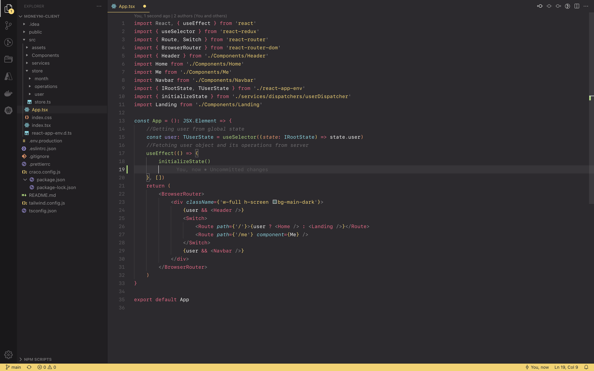
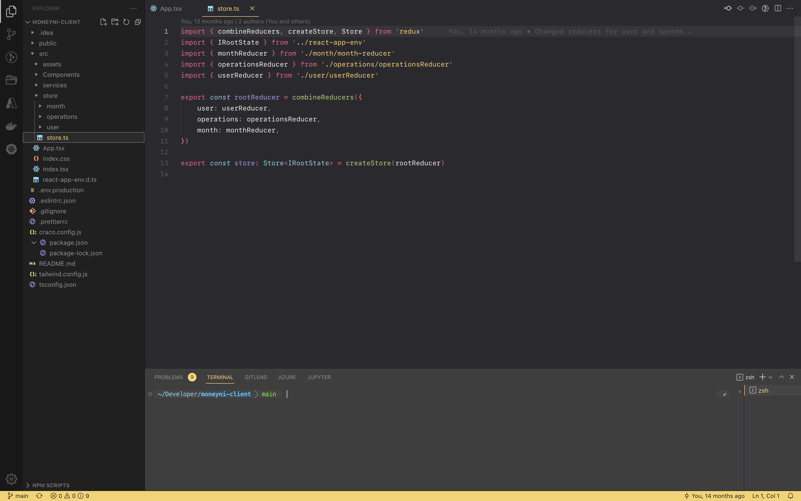

## VSCode config

This repository represents my VSCode config.

Right now I have decided to move to Nvim, but this config will stay here, and in case of emergency, I will get back here. And please, don't hesitate to try it yourself. :D

Sections:

- [Plugins](#1.-plugins)
- [Custom Keymaps](#2.-keymaps)
- [Config](#3.-config)
- [Theme](#4.-theme)
- [Screenshots](#5.-some-screenshots)

---

## 1. Plugins

##### DevOps related

- Azure Tools
- YAML
- Kubernetes
- Docker
- Terraform

##### Basic configuraion

- GitLens
- Rest Client
- Project Manager
- TODO Highlight v2
- DotENV
- Code Spell Checker

##### TS/JS related

- Prettier
- ESLint
- Tailwind CSS IntelliSense
- vscode-styled-components
- TS/JS postfix completion
- dotenv-autocomplete

##### Python related

- Python
- Pylance

##### Theme

- Monokai

---

## 2. Keymaps

I have currently only one custom key map.

- View: Toggle Terminal - CTRL + § (Basically CTRL and the button to the left of 1)

---

## 3. Config

You can find it under settings.json file

---

## 4. Theme

I am using Monokai theme. It is paid, and I have paid for it and recommend you to do it, as it is a very good theme with nice icons.

I have also added some color customizations to the workbench, so the theme looks even more organic and beautiful. You can check these customizations in the settings.json file under `// Workbench settings` comment. It mostly customizes the bottom line.

---

## 5. Some Screenshots

Screenshot of the editor:

Screenshot of the terminal:

